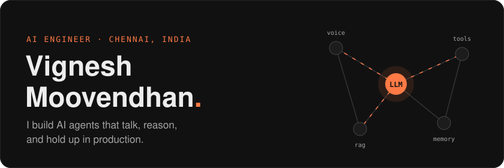
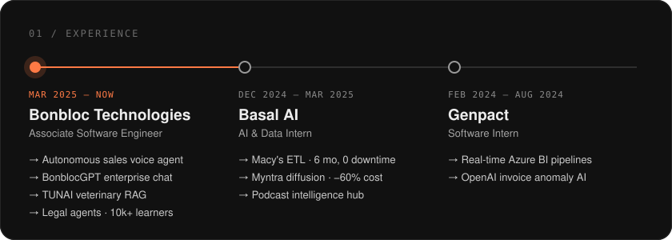
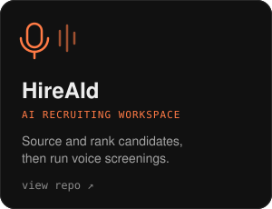
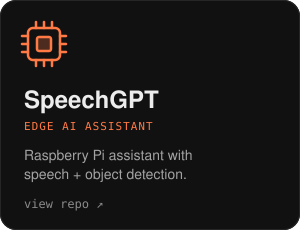
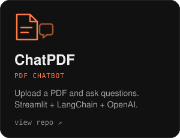
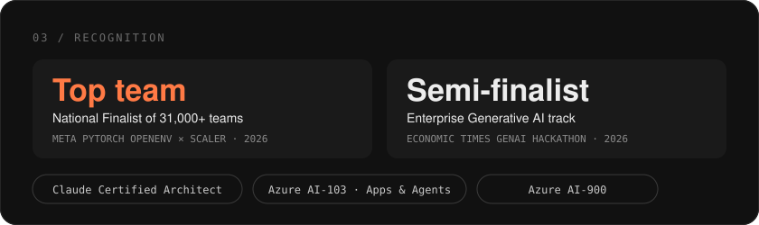
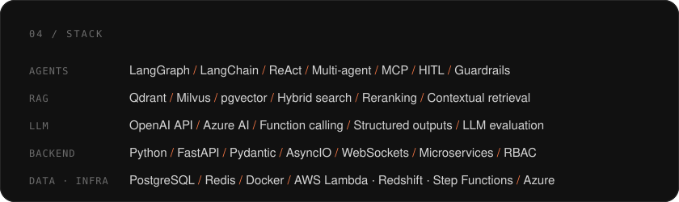

  <a href="https://vignesh-moovendhan-genai.ai.studio/">Portfolio ↗</a>
  &nbsp;·&nbsp;
  <a href="https://www.linkedin.com/in/vigneshoffcl/">LinkedIn ↗</a>
  &nbsp;·&nbsp;
  <a href="mailto:vigneshoffclmail@gmail.com">Email ↗</a>

 

  

  

  

  

